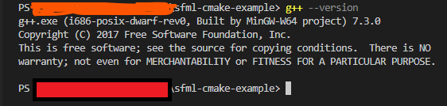
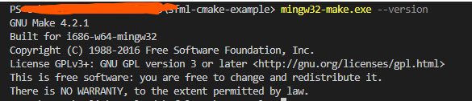
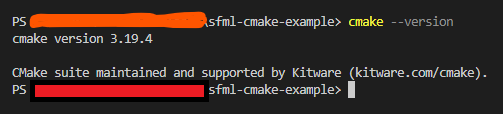

# sfml-cmake-example
SFM self contained example to be built with windows mingw

1. Install mingw, I tested with MingW-64 7.3.0, which is the same used by sfml devs to compile the pre built code.
   1. Use this [link](https://sourceforge.net/projects/mingw-w64/files/Toolchains%20targetting%20Win32/Personal%20Builds/mingw-builds/7.3.0/threads-posix/dwarf/i686-7.3.0-release-posix-dwarf-rt_v5-rev0.7z/download) or search for MingW 7.3.0 64
   2. After installation you might need to configure the windows PATH variable to be able to find the MingW compiler, you can find more information about configuring the PATH variable on this [link](https://code.visualstudio.com/docs/cpp/config-mingw#:~:text=In%20the%20Windows%20search%20bar,path%20to%20the%20system%20path)
   3. If configured correctly the command `g++ --version` on the power shell will output something like the following image:
    
   4. You should also be able to run `mingw32-make.exe --version` to check the mingw-make, if installed the output should be the following
    

2. Install [cmake for windows](https://cmake.org/download/), I tested with cmake 3.19, but you might be able to compile with lower versions if needed.
   1. Like the mingw cmake should also be accessible by your power shell terminal by typing `cmake --version`. If installed and configured correctly, the following output should be printed:
    

3. Compile with the following commands, on windows power shell:
   ```sh
   mkdir build
   cd build
   cmake .. -G"MinGW Makefiles"
   cmake --build . --target sfml_test
   ```